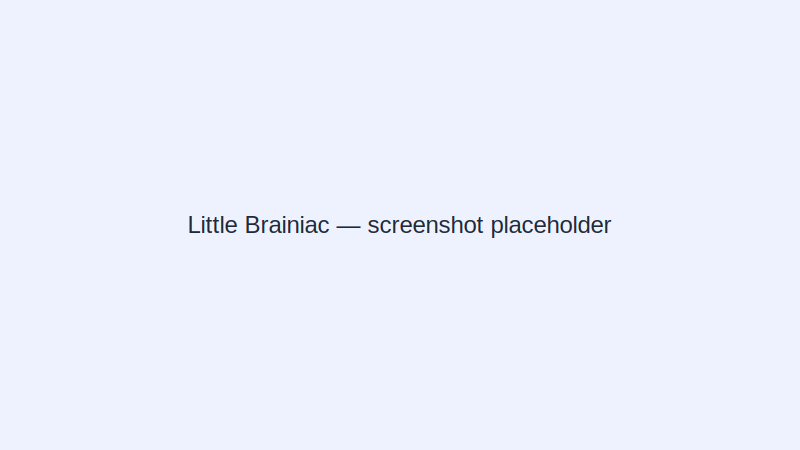

# Project-N

ที่เก็บนี้ประกอบด้วยเว็บแอปสองตัว (React + Vite) สำหรับการส่งรายวิชา:

- **Brain Booster: Zoo Adventure** — https://pootanapat.github.io/Project-N/brain-web/
- **Little Brainiac: Hidden Object Zoo** — https://pootanapat.github.io/Project-N/little-web/

## ลิงก์ด่วน
- Brain web: `docs/brain-web` (deploy บน GitHub Pages)
- Little web: `docs/little-web` (deploy บน GitHub Pages)

## การติดตั้งสำหรับพัฒนา (Local)
แต่ละแอปแยกกัน (TypeScript + Vite). รันบนเครื่องได้ดังนี้:

```bash
# Brain web
cd Project-N/brain-web
npm install
npm run dev

# Little web
cd Project-N/little-web
npm install
npm run dev
```

## สร้างเวอร์ชัน production
```bash
# Build ทั้งคู่
cd Project-N/brain-web && npm run build
cd Project-N/little-web && npm run build
```

## CI / Auto-deploy
มี GitHub Actions workflow (`.github/workflows/pages-deploy.yml`) ที่จะ build ทั้งสองแอปเมื่อมีการ push ไปยัง `main` และ deploy ผลลัพธ์ไปยัง GitHub Pages ที่ subpaths:

- `/brain-web/`
- `/little-web/`

## Release / การส่งงาน
Release จะถูกสร้างเป็น tag และแนบไฟล์ zip (ดูในโฟลเดอร์ `releases/`)

## สมาชิกทีม
ดูรายละเอียดได้ที่ `Member.md`

---

## Screenshots 📸

**Brain Booster: Zoo Adventure**


**Little Brainiac: Hidden Object Zoo**



---

ถ้าต้องการให้ผมเปลี่ยนภาพหน้าจอจริง ๆ ให้ผมรู้ — ผมสามารถอัปโหลดภาพของคุณหรือให้คำแนะนำวิธี capture แล้วผมจะอัปเดต `README.md` ให้.